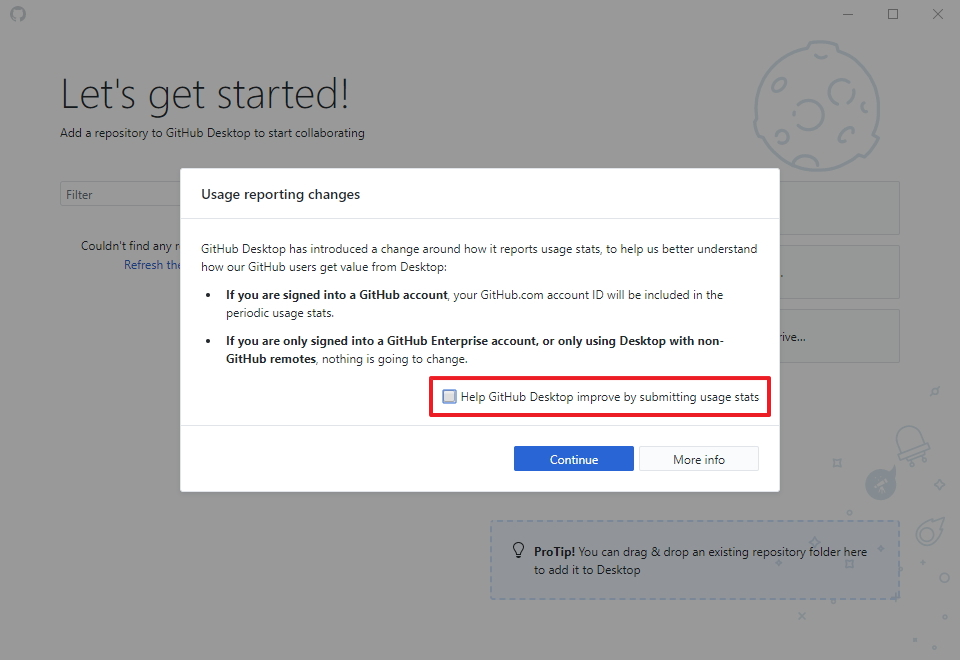
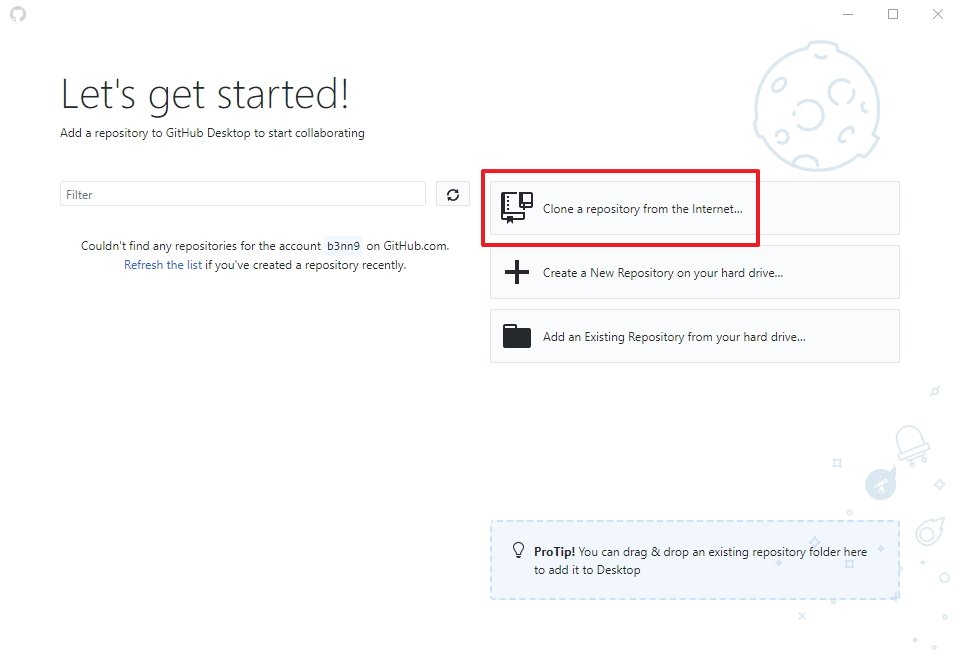
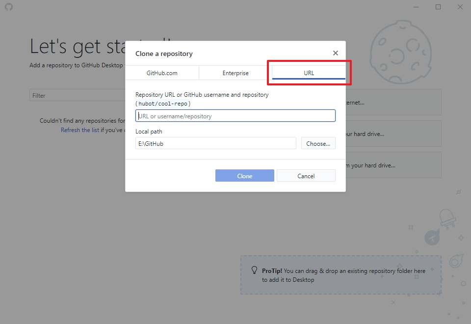
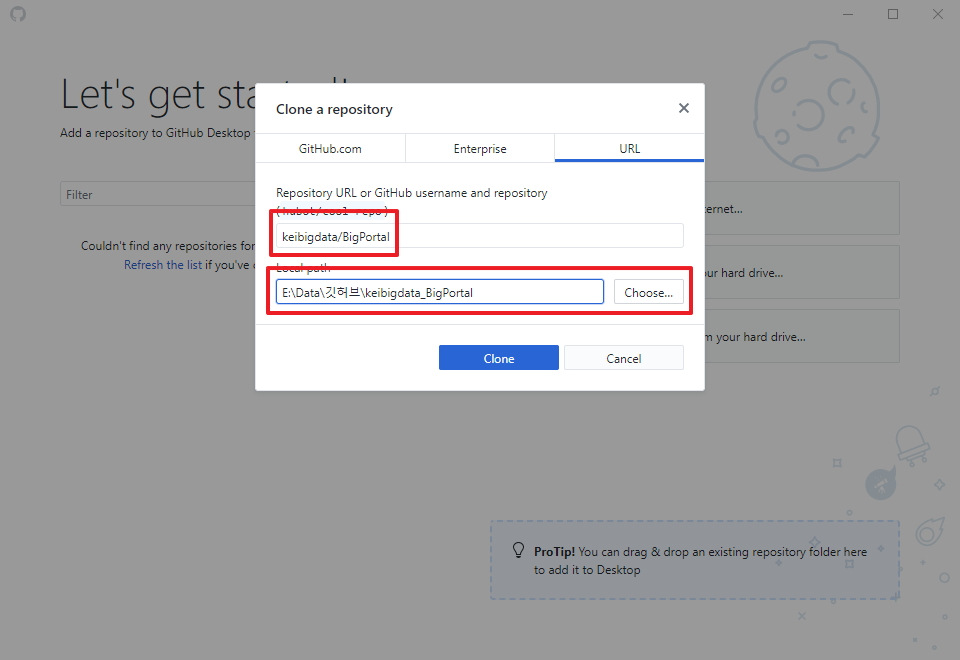

## 깃허브 데스크탑(GitHub Desktop) - [URL](https://desktop.github.com/)
- 다운로드 : [윈도우(64비트)](https://desktop.githubusercontent.com/releases/1.6.2-f9fea0e6/GitHubDesktopSetup.exe)
- 다운받아서 설치하자.
### 깃허브 데스크탑 실행하기
- 실행하면, 아래와 같은 창이 보이며, Continue를 클릭하자.  
  깃허브에 기여할지는 본인의 선택이다.  
  
###  
  (깃허브에 올려진 깃을 수정할 때)  
  
- URL을 선택한다.  
  
  (저장소 위치와 다운받아서 저장할 위치를 변경한다.  
  
