## 깃허브 데스크탑(GitHub Desktop) - [URL](https://desktop.github.com/)
- 다운로드 : [윈도우(64비트)](https://desktop.githubusercontent.com/releases/1.6.2-f9fea0e6/GitHubDesktopSetup.exe)
- 다운받아서 설치하자.
### 깃허브 데스크탑 실행하기
- 실행하면, 아래와 같은 창이 보이며, Continue를 클릭하자.  
  깃허브에 기여할지는 본인의 선택이다.  
  
###  
  (깃허브에 올려진 깃을 수정할 때)  
  
- URL을 선택한다.  
  
  원격 저장소 위치와 다운받아서 저장할 위치를 변경한다.  
  
- 로컬 저장소을 업데이트한다.  
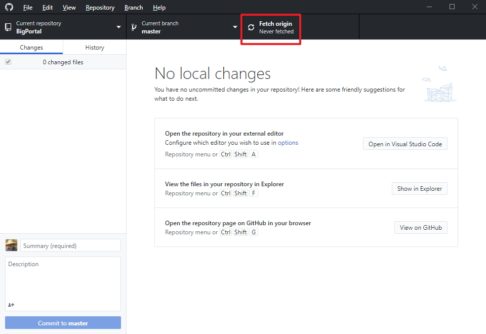  
  (로컬 저장소에 파일이 다운로드된다.)
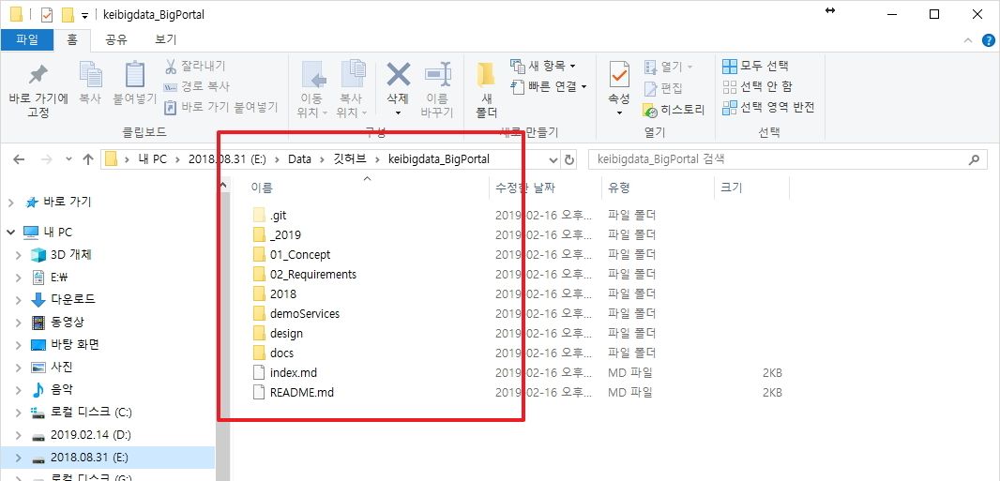  
- 로컬 저장소를 수정 후 깃허브 데스크톱을 클릭하면 변경된 파일 목록이 나타난다.  
  변경사항 제목(필수)과 내용(선택)을 작성하면, 하단의 커밋(Commit) 버튼이 활성화된다.  
  커밋을 클릭하자.
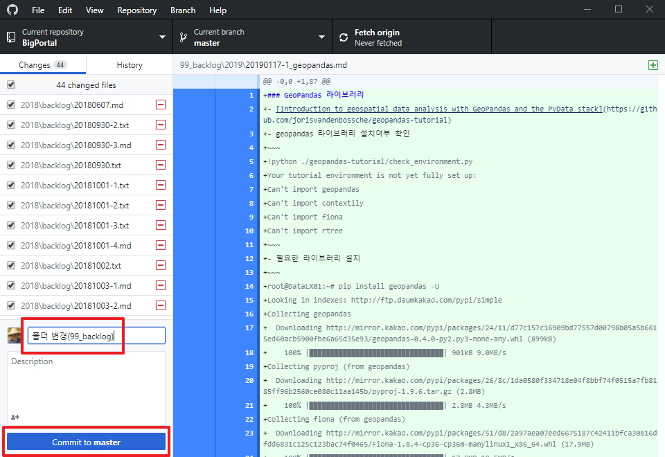  
- 푸시(Push)를 해야 원격 저장소에 반영된다.(오류가 난다면, 팁을 확인하자.)  
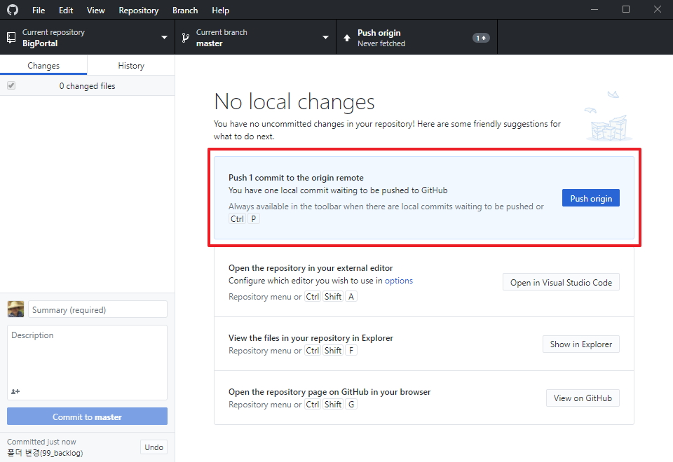  
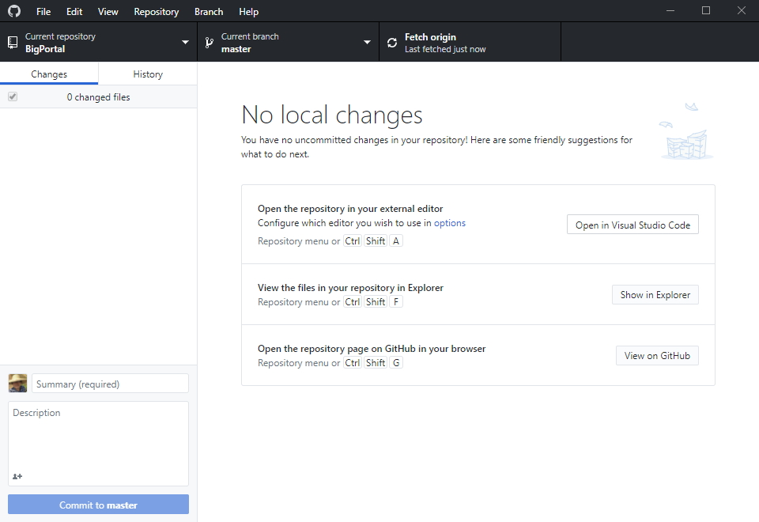  

### 팁
- 원격 저장소에 푸시할 때, 아래와 같은 오류가 난다면, 인증정보를 확인해야한 후 수정하고 다시 푸시한다.  
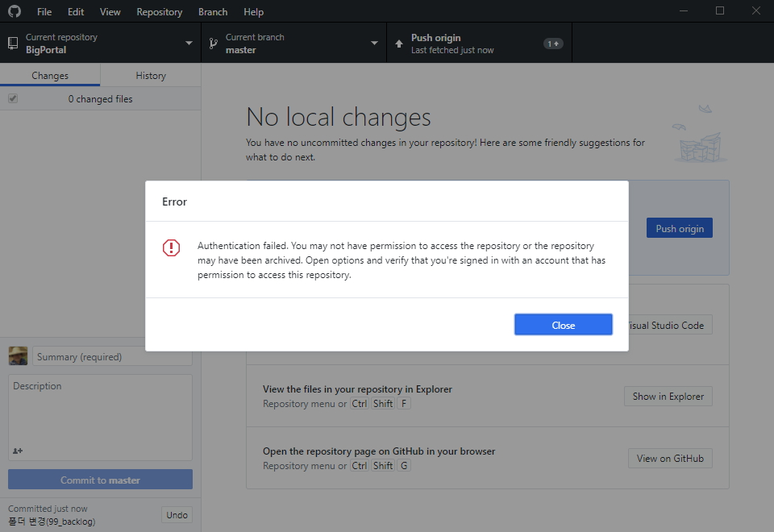  
  (Close 를 클릭하고 메뉴 중 File > Options 로 간다.)
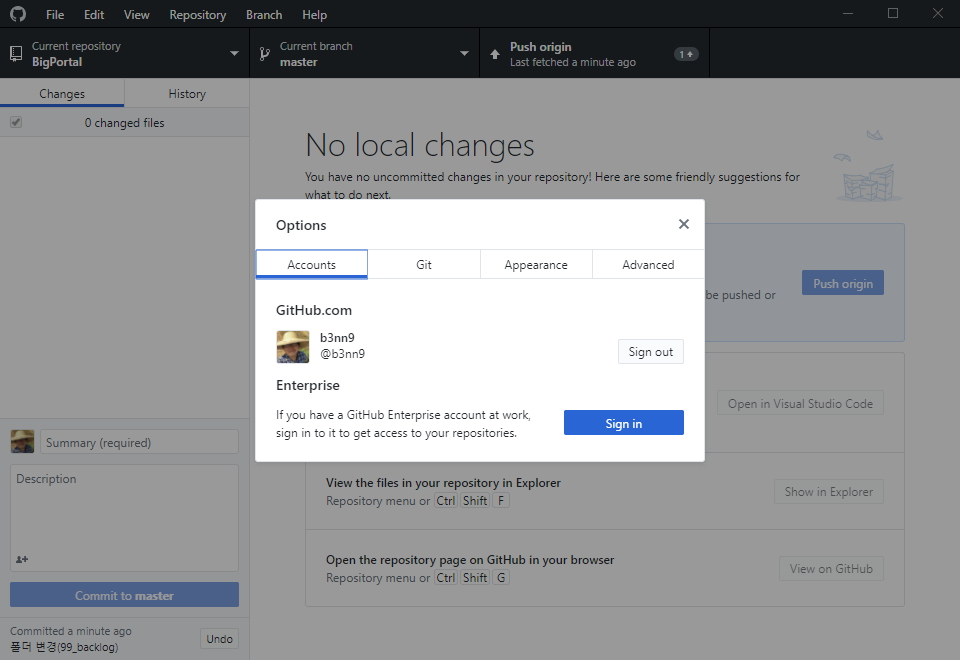    
  (인증정보가 없다면, 등록하고 있다면, 깃허브 웹사이트의 권한을 확인한다.)
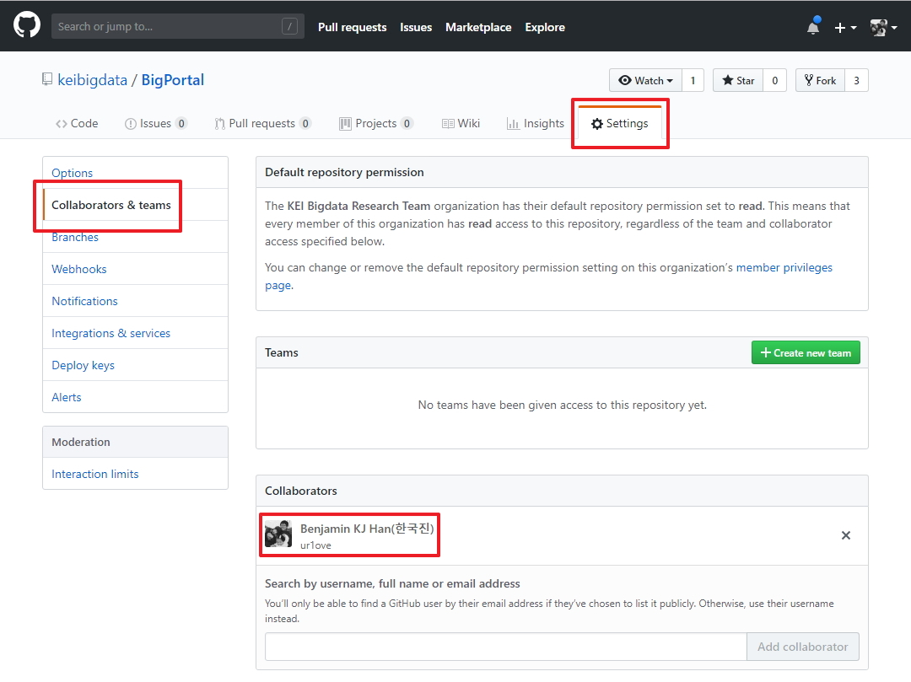   
  (인증정보가 다르다면, 로그아웃(Sign out)한 후 다시 로그인(Sign In)한다.)  
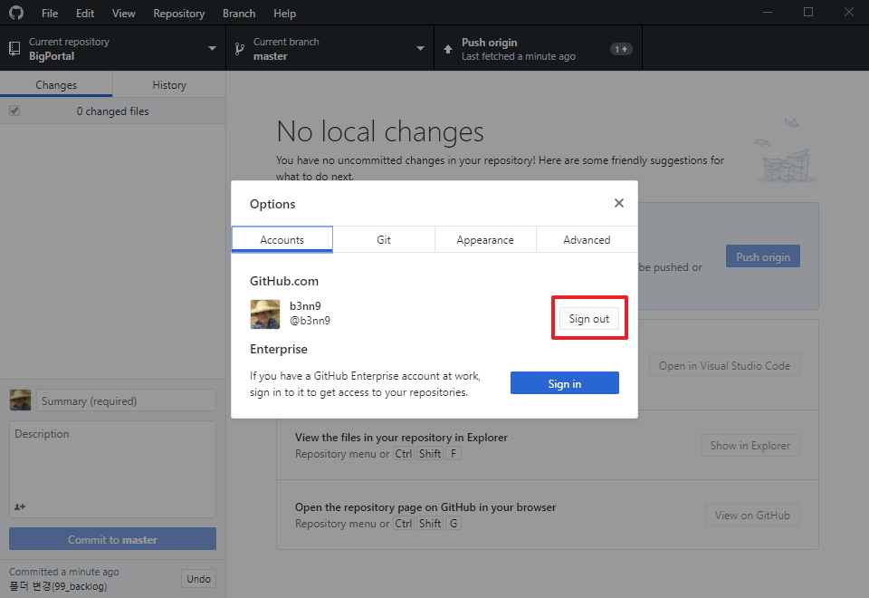   
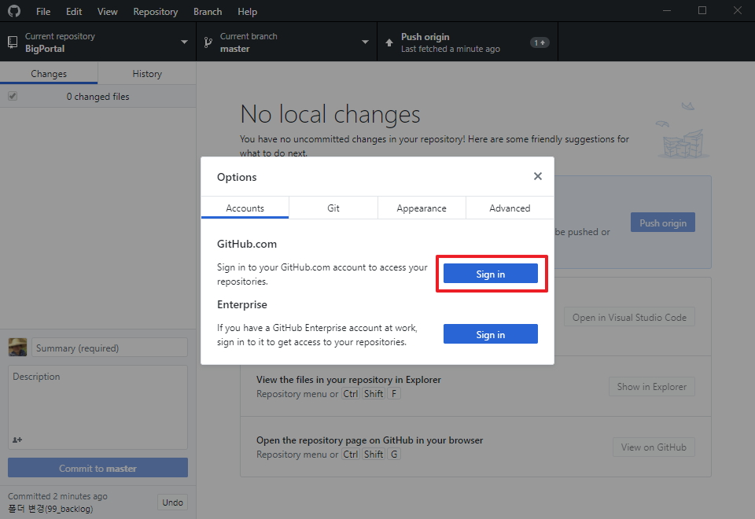   
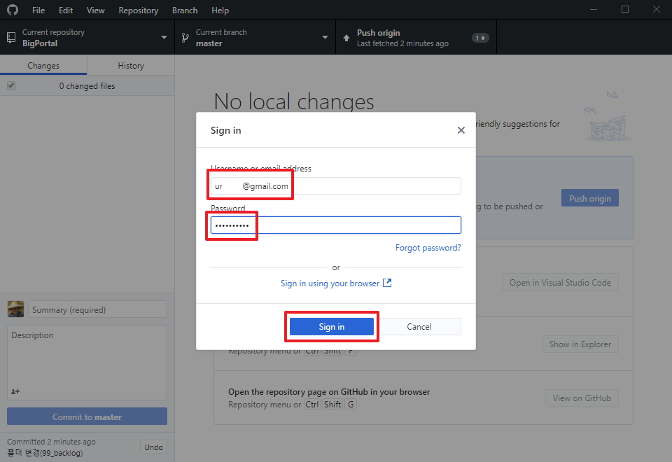   
  (다시 푸시한다.)
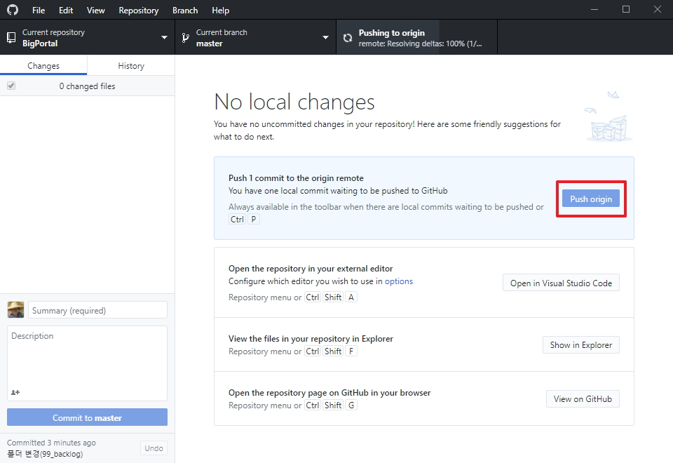  
  
