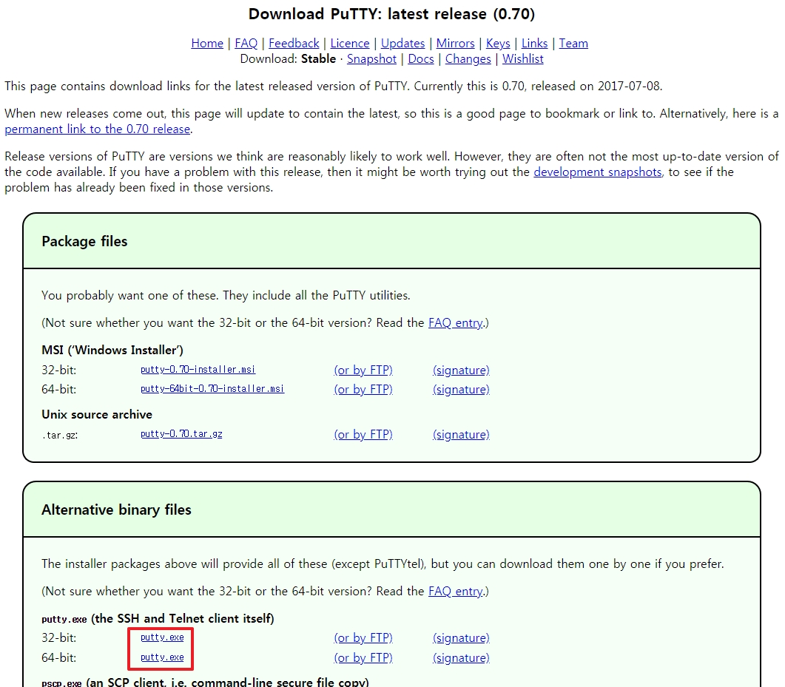
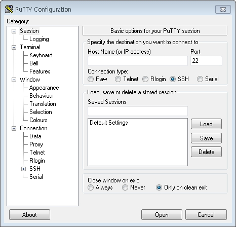
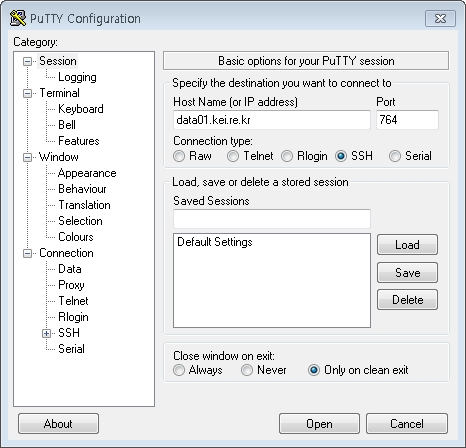
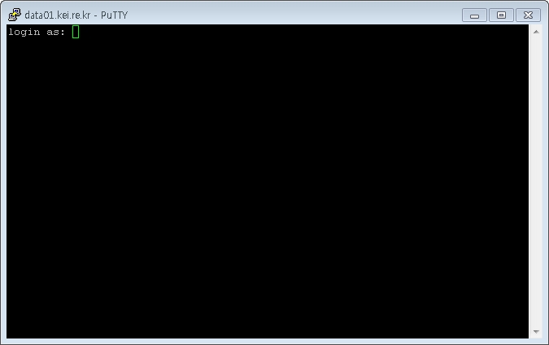
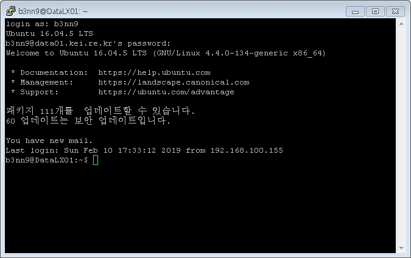
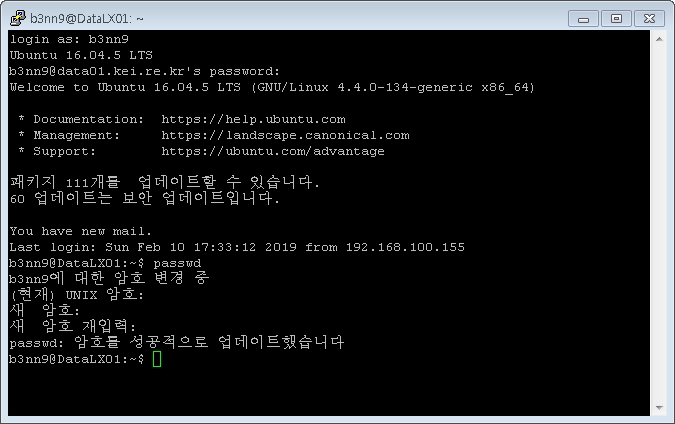
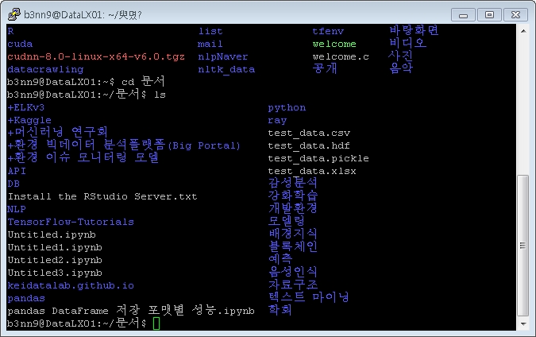

## 보안쉘(SSH) 사용하기
- 시범서비스는 [우분투 리눅스](https://www.ubuntu.com/) 가 설치되어 있음  
- 다운로드 : [PuTTY](https://www.chiark.greenend.org.uk/~sgtatham/putty/latest.html)  
### 접속방법
  
  
  
  
  
  
  
### 팁
- 연결이 자꾸 끊어집니다.  
  5분 동안 아무 것도 입력하지 않으면 끊어지도록 설정되어 있습니다.  
  장시간의 작업이 필요하시면 쉘에서 export TMOUT=0 을 입력하십시오.  
  연결 종료 시까지 강제 종료되지 않습니다.  
~~~
~@DataLX01:~$ echo $TMOUT
300
~@DataLX01:~$ export TMOUT=0
~@DataLX01:~$ echo $TMOUT
0
~~~
