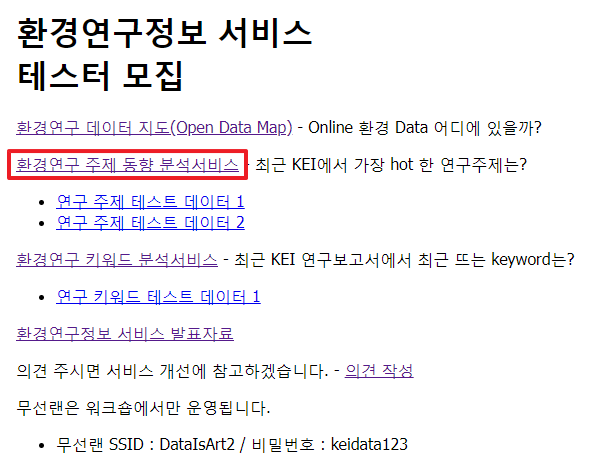
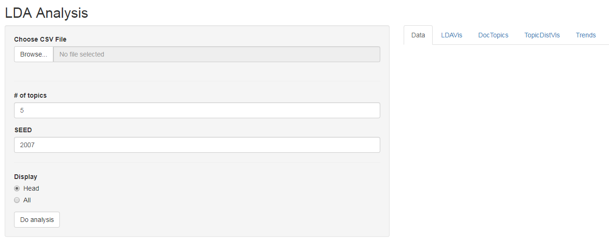
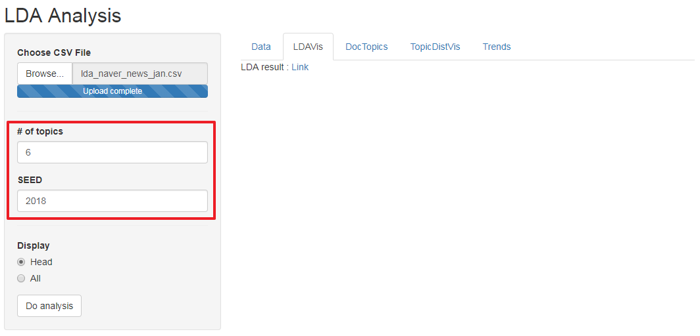

## 환경연구 주제 분석서비스
- 원내에서 http://data01.kei.re.kr/ 로 접속합니다.  
아래 그림과 같이 환경연구정보 서비스 테스터 모집 옆 바로가기를 클릭합니다.
  
- 환경연구 주제 동향 분석서비스을 클릭합니다.  
  (1) 테스트 데이터를 다운로드 합니다.  
  (2) '환경연구 주제 동향 분석서비스'를 클릭합니다.  
   
(접속 후 메인화면)  
   
- 환경연구 데이터 지도의 기능은 다음과 같습니다.  
1) 연구자가 지정한 개수의 주제 수로 분류합니다.    
  (1) # of topics : 주제 개수를 지정합니다.  
  (2) SEED : 동일한 데이터에 대해 같은 SEED 값을 사용하면, 동일한 결과를 볼 수 있습니다.  
   
2) 한 페이지에 표시할 수 있는 최대 목록을 설정할 수 있습니다.(10, 25, 50, 100개)  
   
최대 목록을 초과하는 경우, 오른쪽 아래 페이지 이동 기능이 있습니다.  
   
(페이지 왼쪽 아래 부분에 페이지 위치와 총 연구데이터 정보 개수를 표시합니다.)  
   
3) 검색기능을 사용할 수 있습니다.
   
