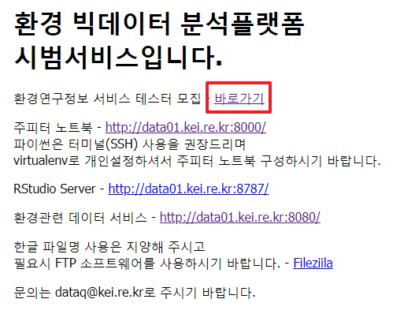

## 환경연구 주제 분석서비스
- 원내에서 http://data01.kei.re.kr/ 로 접속합니다.  
아래 그림과 같이 환경연구정보 서비스 테스터 모집 옆 바로가기를 클릭합니다.
  
- 환경연구 주제 동향 분석서비스을 클릭합니다.  
  (1) 테스트 데이터를 다운로드 합니다.  
  (2) '환경연구 주제 동향 분석서비스'를 클릭합니다.  
   
(접속 후 메인화면)  
   
- 환경연구 데이터 지도의 기능은 다음과 같습니다.  
1) 연구자가 지정한 개수의 주제 수로 분류합니다.    
  (1) # of topics : 주제 개수를 지정합니다.  
  (2) SEED : 동일한 데이터에 대해 같은 SEED 값을 사용하면, 동일한 결과를 볼 수 있습니다.  
  (3) Head : 데이터 탭에 데이터를 일부만 표시합니다.  
  (4) All : 데이터 탭에 전체 데이터를 표시합니다.(데이터가 많은 경우, 느릴 수 있습니다.)  
  (5) 주제 재수(# of topics)와 SEED(기준값) 설정 후 'Do anlaysis'를 클릭합니다.  
2) 분석결과를 LDAVis로 시각화하여 보여줍니다.
  (1) LDAVis 탭을 클릭하면 아래와 같이 LDA result: Link가 보입니다.  
      데이터가 많은 경우, 느릴 수 있습니다.  
   
  (2) 위 링크를 클릭하면 시각화 웹페이지로 이동합니다.
   
3) 각각의 주제군에 포함된 주제를 확인할 수 있습니다.    
   
4) 각 주제군의 비율을 확인할 수 있습니다.  
   
5) 주제 동향을 확인할 수 있습니다.
   
