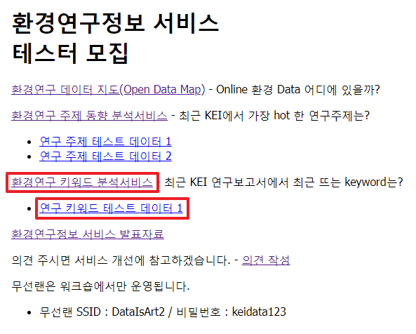

## 환경연구 키워드 분석서비스
- 키워드 분석서비스 설명서(기본)
- 주의 및 참고사항
- 키워드 분석서비스 설명서(상세)
### 키워드 분석서비스 설명서(기본)
- 원내에서 http://data01.kei.re.kr/ 로 접속합니다.  
아래 그림과 같이 환경연구정보 서비스 테스터 모집 옆 바로가기를 클릭합니다.
  
- 테스트 데이터를 다운로드한 후 키워드 분석서비스에 접속합니다.
1) '연구 키워드 테스트 데이터 1' 클릭하여 테스트 데이터를 다운로드합니다.
2) '환경연구 키워드 분석서비스'를 클릭합니다.  
   
(접속 후 메인화면)  
   
- 환경연구 분석서비스의 기능은 다음과 같습니다.  
1) 분류체계와 대상기간을 변경할 수 있습니다.  
   
2)
ㅣ
lhs(Left Hand Side), rhs(Right Hand Side) : lhs → rhs
support(지지도) : P(lhs ∩ rhs), lhs와 rhs가 동시에 나타는 확률, 높으면 상관관계가 있음
confidence(신뢰도) : P(rhs | lhs), lhs가 있을 때, rhs가 있을 확률, 높으면 상관관계가 있음
lift(향상도) : P(rhs | lhs) / P(rhs), lhs가 상관없이 rhs가 나타날 확률
lhs와 rhs가 독립이라면, P(rhs ∩ lhs) = P(lhs) * P(rhs)이므로
P(lhs) * P(rhs)  / P(lhs) * P(rhs) = 1, 즉 lift가 1이 됩니다.(관련이 없을 경우)
따라서 lift > 1, 상관관계가 높고 lift < 1, lhs가 있을 때, rhs가 없을 확률이 높음을 의미합니다.
count(출현빈도)

   
  동일한 연구결과를 재생할 수 있습니다.(동일한 SEED 값 적용 시) 
   
(페이지 왼쪽 아래 부분에 페이지 위치와 총 연구데이터 정보 개수를 표시합니다.)  
   
3) 검색기능을 사용할 수 있습니다.
   
