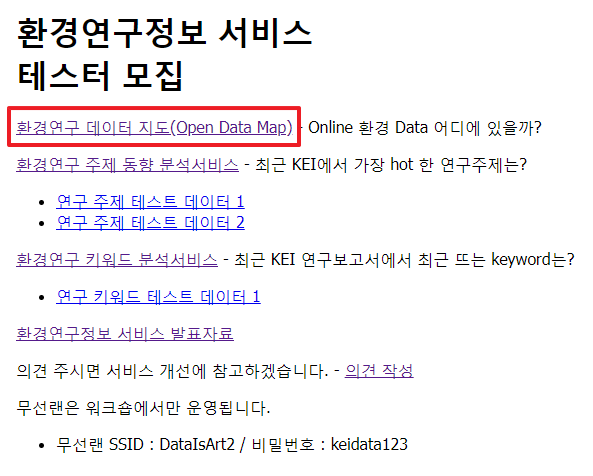
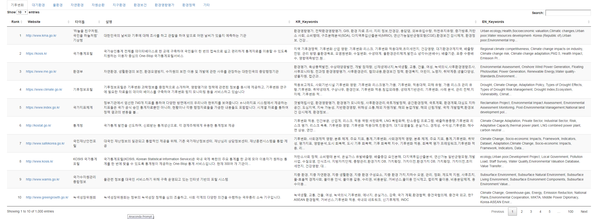

## 환경연구 데이터 지도(Open Data Map)
- 원내에서 http://data01.kei.re.kr/ 로 접속합니다.  
아래 그림과 같이 환경연구정보 서비스 테스터 모집 옆 바로가기를 클릭합니다.
  
- 환경연구 데이터 지도(Open Data Map)을 클릭합니다.  
   
(접속 후 메인화면)  
   
- 환경연구 데이터 지도의 기능은 다음과 같습니다.  
1) 총 10개의 환경 분야에 대한 연구데이터 정보를 제공합니다.  
   
2) 한페이지에 10, 25, 50, 100개의 목록을 표시합니다.  
   
목록이 페이지를 초과하는 경우, 오른쪽 아래 페이지 이동기능을 제공합니다.  
   
(왼쪽 아래 페이지 위치와 총 연구데이터 정보 개수를 표시합니다.)  
   
3) 검색기능을 제공합니다.
   
